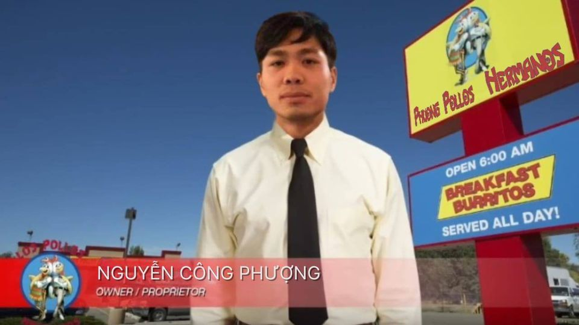

# POWER OF FRIENSHIP ඞඞඞඞඞඞඞඞඞඞඞඞඞඞඞඞඞඞඞඞඞඞඞඞඞඞඞඞඞඞ

Nhớ hồi phiêu lịch di chỉ tàn đế tại hạ có qua 1 phiến đá mạn thấy ghi vài dòng rằng "vào đầu thời tạo hóa dân chúng còn chưa biết đến linh khí vị diện, tuổi thọ ngắn ngủi, không thể chống lại tự nhiên, bỗng từ đâu có một kẻ thân mang dòng máu khổng tước và phượng hoàng cao quý, ngài thấy chúng sinh lầm than mà mềm lòng không kìm được, ngài bèn dùng công pháp của mình hóa những cánh gà bình thường thành cánh tước cánh phượng có pháp lực vô biên và ẩn chứa 1 tia nguyên khí thần của ngài để ban phát với mong muốn cứ khổ cứu nạn phổ độ chúng sinh. Người đời ăn được cánh gà của ngài bỗng linh khí nhập thể, giải khai thiên nhãn, mở ra đan điền, khiến người thường cũng có thể ngự không chi pháp, chưởng khống không gian và tuổi thọ tăng vọt. Ngay cả vị đế kia cũng nói rằng để có pháp lực như hôm nay hắn cũng đã ăn qua cánh gà của ngài".

⭕️⭕️\_____/⭕️⭕️             𝗖𝗘𝗢 𝗢𝗙 𝗢𝗛𝗜𝗢𝗖𝗘𝗢 𝗢𝗙 𝗢𝗛𝗜𝗢𝗖𝗘𝗢 𝗢𝗙 𝗢𝗛𝗜𝗢𝗖𝗘𝗢 𝗢𝗙 𝗢𝗛𝗜𝗢𝗖𝗘𝗢 𝗢𝗙 𝗢𝗛𝗜𝗢𝗖𝗘𝗢 𝗢𝗙 𝗢𝗛𝗜𝗢𝗖𝗘𝗢 𝗢𝗙 𝗢𝗛𝗜𝗢            ⭕️⭕️\_____/⭕️⭕️

I remember when I was traveling to the ruins of the Emperor, there was a stone tablet on the side that said a few lines that "at the beginning of creation, people did not yet know about the aura of the plane, their lifespan was short, they could not fight against nature. Suddenly, out of nowhere, there was a person with the blood of a noble king and phoenix. He saw sentient beings suffering and couldn't help but soften his heart. He used his technique to turn ordinary chicken wings into phoenix wings. His magical power is boundless and contains a ray of divine energy to give with the desire to save all living beings from suffering and suffering. People who eat his chicken wings suddenly have spiritual energy incarnated, releasing their heavenly eyes and opening up Dantian, allowing ordinary people to be able to control the sky, control space and increase their lifespan. Even that emperor said that to have the magic power like today, he had to eat your chicken wings."

Một vị Vua da màu! Ngài Speed Nguyen, tên tự là Mai Ninh Gà (Tomorrow Stew Chicken) chụp ảnh lưu niệm trong chuyến công du tới Đại Việt ta.
A Black King! Mr. Speed ​​Nguyen, whose real name is Mai Ninh Ga (Tomorrow Stew Chicken), took souvenir photos during his trip to Dai Viet.

